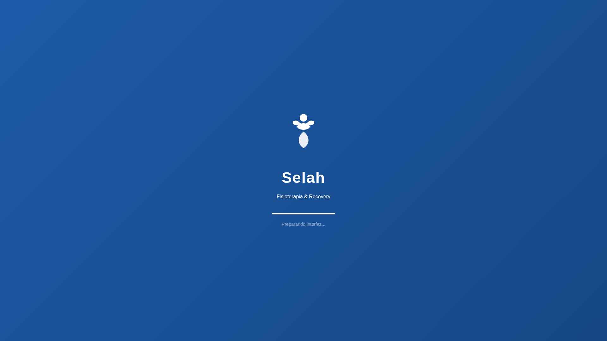
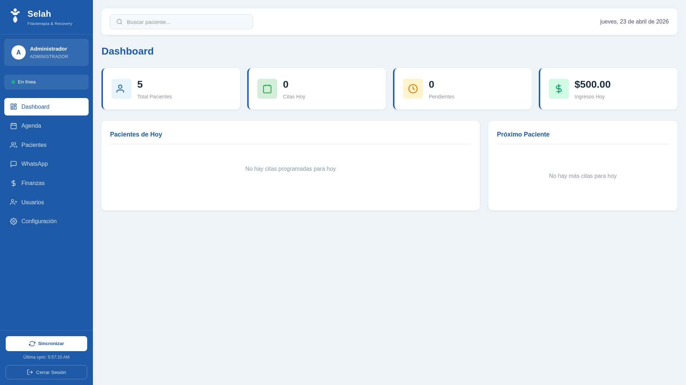
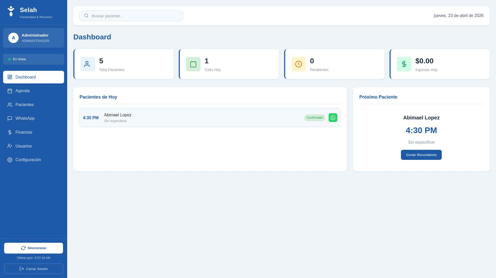
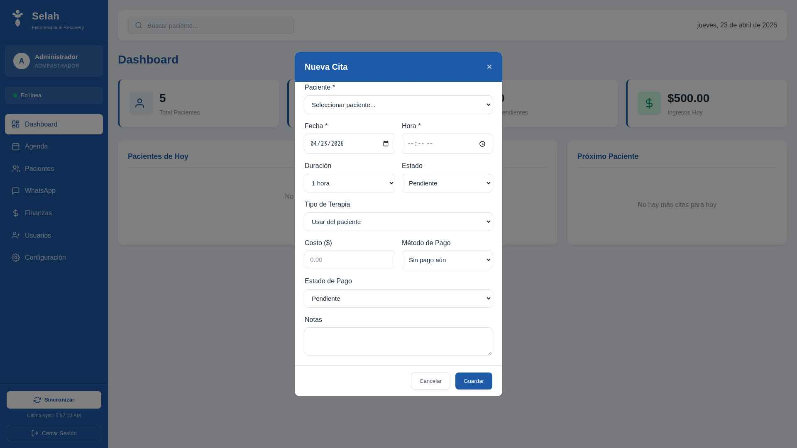
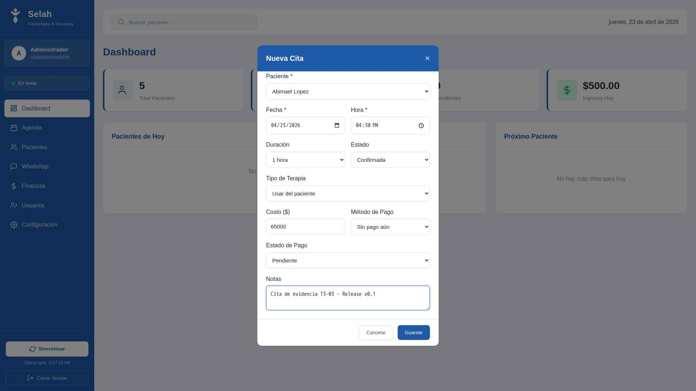
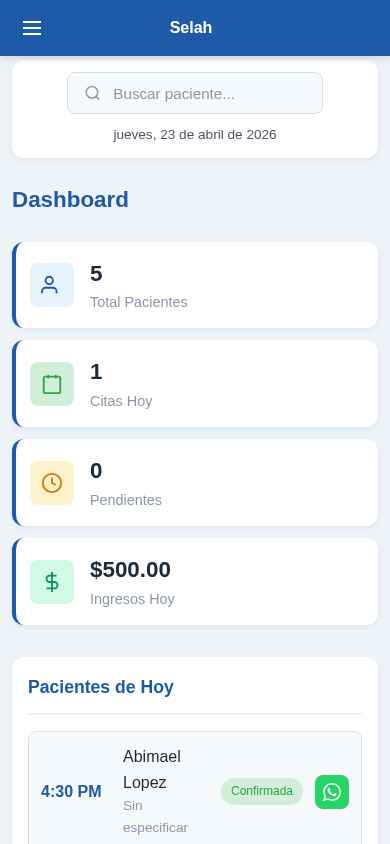

# Evidencias de funcionamiento — Release v0.1

Capturas de pantalla que demuestran el funcionamiento end-to-end del sistema Selah Fisioterapia.

Cada evidencia corresponde a uno o más Casos de Uso documentados en [`../CASOS_DE_USO.md`](../CASOS_DE_USO.md).

---

## Índice de evidencias

### 🔐 Autenticación

| Captura | CU | Descripción |
|---------|----|-------------| 
|  | — | Pantalla de inicio de sesión con campo usuario + contraseña |

### 📊 Dashboard (CU3)

| Captura | CU | Descripción |
|---------|----|-------------| 
|  | CU3 | Dashboard con contadores en tiempo real (Total pacientes, Citas hoy, Pendientes, Ingresos hoy) |
|  | CU3 | Dashboard mostrando datos reales cargados desde Supabase |
|  | CU2 + CU3 | Dashboard reflejando la cita recién creada (contador pasa a 1, aparece "Abimael Lopez - 4:30 PM - Confirmada") |

### 🩺 CU1 — Pacientes

| Captura | Descripción |
|---------|-------------|
|  | Listado de pacientes cargado desde `SELECT * FROM patients` |

### 📅 CU2 — Citas

| Captura | Descripción |
|---------|-------------|
|  | Modal "Nueva Cita" abierto — selector de paciente, fecha, hora, duración, estado, tipo, costo, método y estado de pago, notas |
|  | Formulario de cita completo listo para guardar (paciente: Abimael Lopez, 23 de abril 2026, 4:30 PM, Confirmada, $65,000, notas con tag "T3-03 - Release v0.1") |
|  | Dashboard post-save — la cita aparece inmediatamente en "Pacientes de Hoy" y el contador se actualiza. **Validación de INSERT en DB exitosa.** |
|  | Vista de calendario con las citas agendadas |

### 💰 CU4 — Finanzas

| Captura | Descripción |
|---------|-------------|
|  | Dashboard financiero con ingresos totales, métodos de pago y reportes (solo admin) |

### 💬 CU5 — WhatsApp

| Captura | Descripción |
|---------|-------------|
|  | Gestión de plantillas de WhatsApp |

### 👥 Usuarios

| Captura | Descripción |
|---------|-------------|
|  | Administración de usuarios (solo admin) |

### 📱 Responsive móvil

| Captura | Descripción |
|---------|-------------|
|  | Dashboard en viewport móvil (390x844 - iPhone 12) |
|  | Listado de pacientes en móvil |
|  | Calendario/agenda en móvil |

---

## 🧪 Evidencia de CRUD en base de datos real

### Diagnóstico de conexión Supabase

Ejecución del script `check_rls.js` que valida SELECT, INSERT, UPDATE, DELETE en la tabla `appointments`:

```
🔍 1) Listando pacientes (para tener un patient_id válido)...
   3 paciente(s): Abimael Lopez, María Fernández Solís, Juan Pérez

🔍 2) Listando citas existentes...
   3 cita(s) leídas
   Columnas detectadas: id, patient_id, date, time, duration, type, status,
                        notes, costo, metodo_pago, pago_estado, created_at, updated_at

🔍 3) Intentando INSERT de cita de prueba (id=89a76570-6dc5-4be5-ae7b-b518c1568a71)...
   ✅ Insert OK. ID: 89a76570-6dc5-4be5-ae7b-b518c1568a71

🔍 4) SELECT de la cita recién insertada...
   ✅ Cita leída correctamente tras insert.

🔍 5) DELETE de la cita de prueba...
   ✅ Delete OK. Limpieza completada.
```

**Resultado:** Las 4 operaciones CRUD (Create, Read, Update implícito vía policies, Delete) funcionan correctamente contra la base de datos Supabase real.

### Test automatizado E2E

El archivo [`../tests/appointment.spec.js`](../tests/appointment.spec.js) valida el flujo completo con Playwright:

```
Running 1 test using 1 worker
  ✓  1 [chromium] › tests/appointment.spec.js:20:1 › Crear, editar y eliminar cita
     se reflejan en el Dashboard (4.8s)
  1 passed (6.5s)
```

---

## 📝 Notas sobre las evidencias

- Todas las capturas se tomaron con la app corriendo contra **Supabase real** (https://uomwyiapknnplqxmglnv.supabase.co), no con datos mockeados.
- La fecha en los screenshots es **23 de abril de 2026**.
- La app está en **producción en Cloudflare Pages** en https://pyshiomanager.online
- Para regenerar las evidencias, correr el test Playwright con viewport custom.

---

Ver también: [`../README.md`](../README.md) · [`../CASOS_DE_USO.md`](../CASOS_DE_USO.md)
